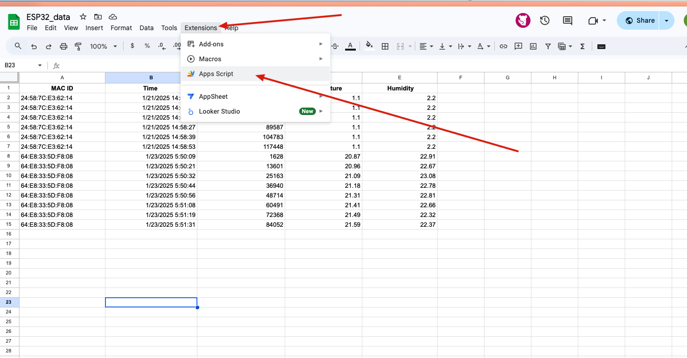
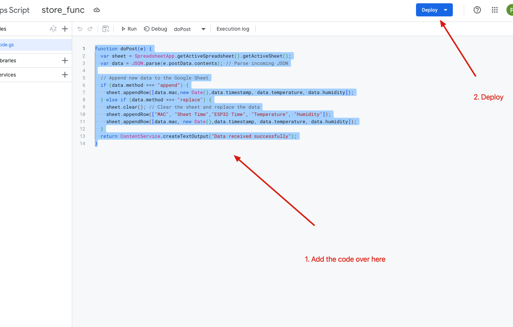
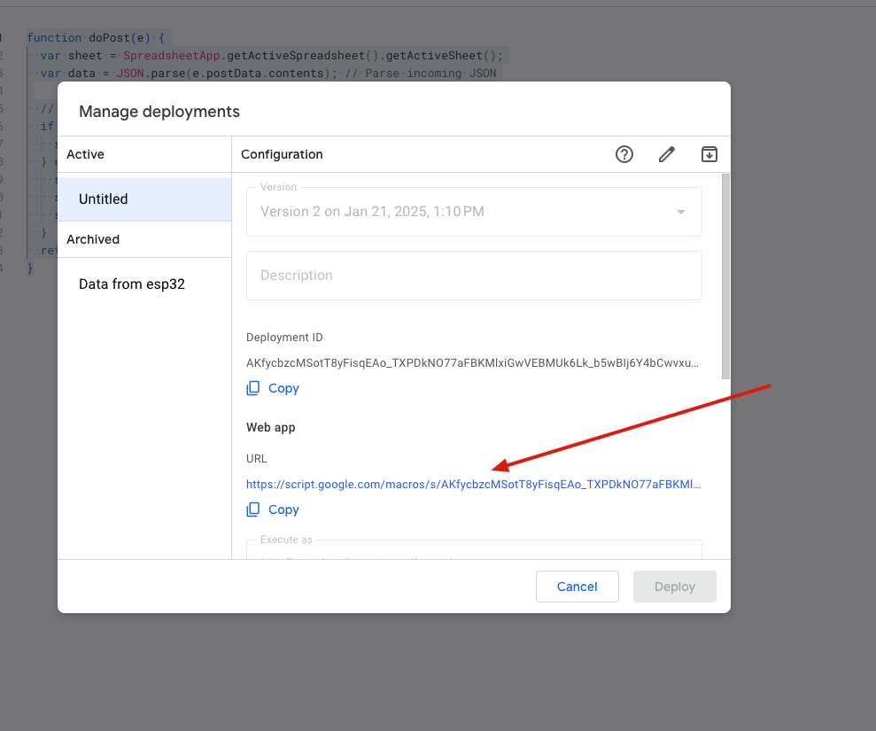
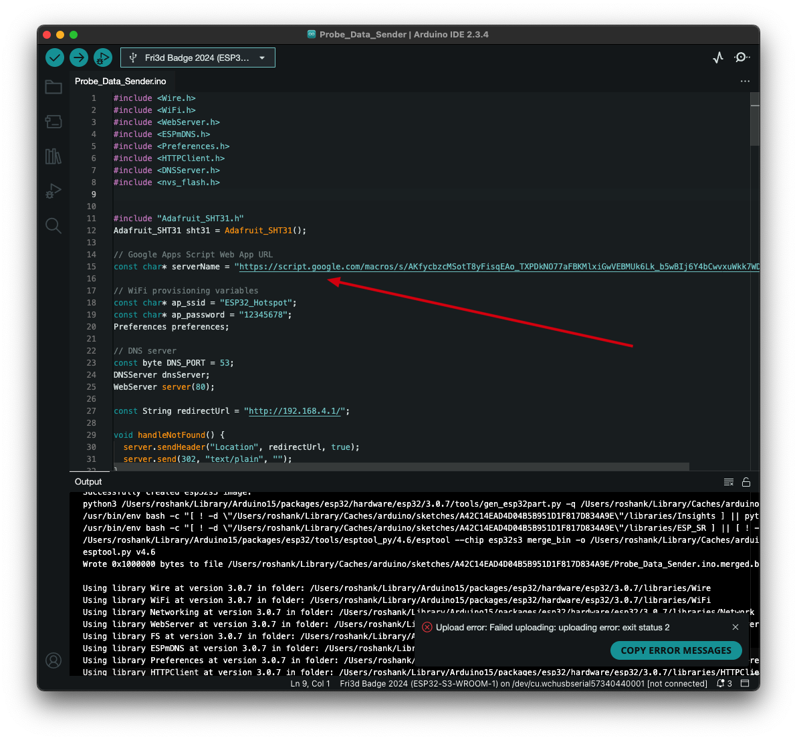

# ESP32 Sensor to Google Sheets

An Arduino sketch for ESP32 that reads temperature and humidity data from an **SHT31 sensor** and automatically logs it to a **Google Sheet** via a Google Apps Script web app. WiFi credentials are configured wirelessly through a built-in captive portal — no USB re-flashing required.

## How It Works

```
ESP32 + SHT31  →  HTTP POST (JSON)  →  Google Apps Script  →  Google Sheet
```

1. On first boot (or if saved credentials fail), the ESP32 creates a WiFi hotspot (`ESP32_Hotspot`) and serves a captive portal for you to enter your WiFi credentials.
2. Credentials are saved to non-volatile storage (NVS) and survive reboots.
3. Once connected, the device reads temperature and humidity every 10 seconds and POSTs the data as JSON to a deployed Google Apps Script web app.
4. The Apps Script appends each reading as a new row in the Google Sheet, recording the device MAC address, server-side timestamp, ESP32 uptime, temperature, and humidity.

## Hardware

| Component | Details |
|---|---|
| Microcontroller | ESP32 (tested on ESP32-S3-WROOM-1) |
| Sensor | Adafruit SHT31 temperature & humidity |
| I2C wiring | SDA → IO16, SCL → IO17 |

## Repository Structure

```
├── Probe_Data_Sender/
│   └── Probe_Data_Sender.ino   # Arduino sketch for the ESP32
├── google-sheet-app-Script.txt # Google Apps Script (doPost function)
├── images/                     # Setup screenshots
└── README.md
```

## Setup

### 1. Google Sheets — Apps Script

1. Open (or create) a Google Sheet where data should be logged.
2. Go to **Extensions → Apps Script**.

   

3. Paste the contents of `google-sheet-app-Script.txt` into the editor and click **Deploy → New deployment**.

   

4. Choose **Web app**, set **Execute as** to *Me* and **Who has access** to *Anyone*. Click **Deploy** and copy the **Web app URL**.

   

### 2. Arduino Sketch

1. Open `Probe_Data_Sender/Probe_Data_Sender.ino` in Arduino IDE.
2. Paste the Web App URL you copied into the `serverName` constant:

   ```cpp
   const char* serverName = "https://script.google.com/macros/s/<YOUR_ID>/exec";
   ```

   

3. Install the required libraries (via Arduino Library Manager):
   - **Adafruit SHT31 Library**
   - **Adafruit BusIO** (dependency)

4. Select your ESP32 board, then **Upload**.

### 3. First-Time WiFi Provisioning

1. On first boot, the device broadcasts a hotspot:
   - **SSID:** `ESP32_Hotspot`
   - **Password:** `12345678`
2. Connect to it from your phone or computer — a captive portal will open automatically (or navigate to `http://192.168.4.1`).
3. Enter your WiFi SSID and password, then submit. The device restarts and connects automatically.

## Google Sheet Columns

| Column | Description |
|---|---|
| MAC | ESP32 MAC address (identifies the device) |
| Time | Timestamp recorded by Google Sheets on receipt |
| ESP32 Time | `millis()` value from the ESP32 (ms since boot) |
| Temperature | °C reading from SHT31 |
| Humidity | % RH reading from SHT31 |

## Resetting WiFi Credentials

To clear saved credentials and re-enter provisioning mode, uncomment these two lines in `setup()`, upload once, then comment them out again and re-upload:

```cpp
nvs_flash_erase();
nvs_flash_init();
```

## Dependencies

- [Arduino ESP32 core](https://github.com/espressif/arduino-esp32)
- [Adafruit SHT31 Library](https://github.com/adafruit/Adafruit_SHT31)
